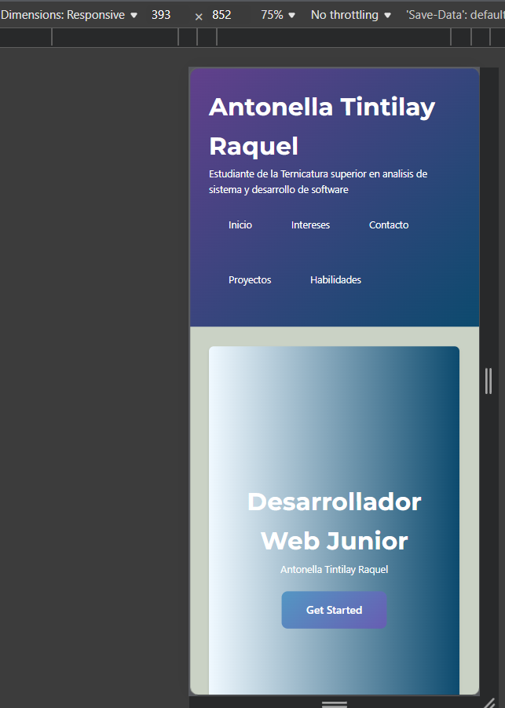
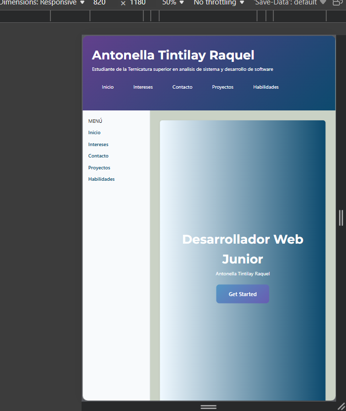
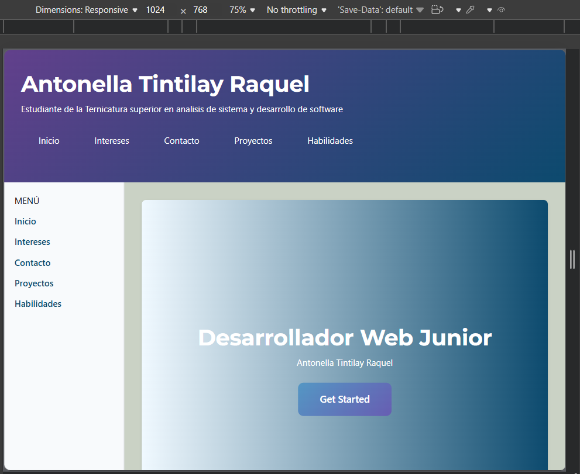

# Antonella Tintilay Raquel
## Trabajo practico N°1
### 16/03/2026

## Descripción
Portafolio personal desarrollado con HTML5 y CSS3, aplicando Flexbox, CSS Grid y diseño responsive

## Mi sitio
https://antonella-tintilay.github.io/tp1-mi-sitio/

## Tecnologias usadas
1. HTML5
2. CSS3
3. Flexbox
4. CSS Grid
5. Responsive Design

## Mobile:

## Tablet:

## Desktop:

## Reflexion
Aprender a usar la terminal es fundamental, aunque tengamos interfaces gráficas que facilitan muchas cosas. la terminal nos permite control total sobre los archivos, carpetas, ejecutar comandos de manera rápida y automatizar tareas que serían lentas con el mouse. Además, muchas herramientas de desarrollo profesional, como Git,  funcionan mejor desde la terminal. Saber usarla también nos ayuda a resolver problemas y depurar errores más eficientemente, porque podemos ver exactamente qué está sucediendo.Aunque al principio parezca difícil, dominar la terminal nos da mayor independencia y confianza a la hora de trabajar con proyectos de programación.

## Ruta de Git
/mingw64/bin/git

[def]: img/mobile.png